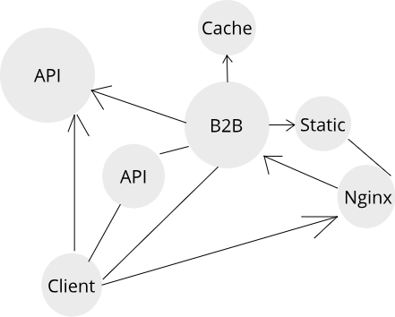
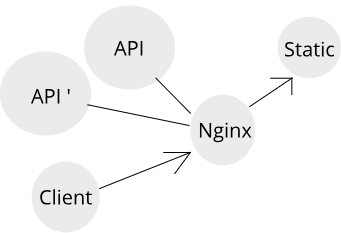
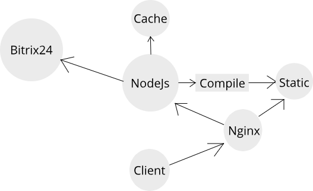

## Краткий обзор и сравнение архитектуры текущих проектов
 
-  B2B
-  Личный кабинет кураторов
-  Время деньги

---

### Проект "B2B"
https://polis.astrovolga.ru/

- Серверный и клиентский рендеринг через шаблонизатор
- MVC
- MVVM

---

### Проект "Личный кабинет кураторов"
https://lk.astrovolga.ru/

- Клиентский рендеринг
- MVVM (Model-View-ViewModel)

---

### Проект "Время деньги"
https://timesheet.astrovolga.ru/

- Серверный и клиентский рендеринг через шаблонизатор
- Backend-for -frontend (BFF), MVVM, MVC
