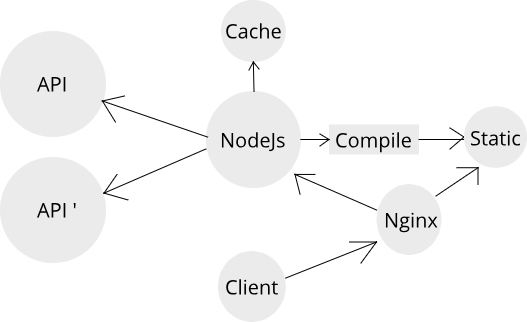

## Проблемы проекта "B2B"

-  Низкая скорость загрузки страниц
-  Перегруженность технологиями и кодом
-  Сложный CI/CD
-  Как следствие, дорогая поддержка и развитие

---

## Оптимальный вариант архитектуры frontend для проекта "B2B"

-  Минимизация нагрузки на серверы бизнес логики (api)
-  Повышение производительности
-  Инкапсуляция логики клиентского приложения
-  Более быстрый CI/CD

