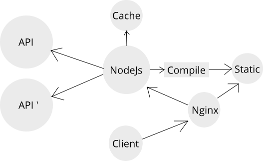

## Минимизация нагрузки на API



-  API концентрируется на бизнес процессах
-  Ресурсы сосредоточены на REST и быстрый ответ с данными
-  Для отображения интерфейса запрос к серверу API не всегда будет необходим (кеш, статика). 
-  Для хранения информации необходимой для настройки интерфейса пользователя можно использовать собственное хранилище 

---

## Повышение производительности


([источник](https://medium.com/@yuiltripathee/node-js-vs-php-comparison-get-the-job-done-purpose-d3d63351ea8a))

-  NodeJs может обрабатывать больше одновременных пользователей, чем PHP
-  PHP лучше работает с высокой вычислительной нагрузкой и может быстрее загружать большие наборы данных

Настоятельно к ознакомлению [Symfony vs Express: A Server-Side Framework Comparison](https://www.diva-portal.org/smash/get/diva2:1327290/FULLTEXT01.pdf)
 
---

## Инкапсуляция логики клиентского приложения

-  Единый язык и инструмент шаблонизации и контекста 
-  Шаблон Контрактов и Typescript обеспечивает связную типизацию

---

### Контракт 

```typescript
// src/contracts/MainPage.ts
import { ITask } from "./ITask";
import { ITaskArrayStatistic } from "../server/task/i-task.service";

export const MAIN_PAGE_URL = "/";

export interface IMainPageUrlProps extends ITaskArrayStatistic {
    tasks: ITask[];
    dateStart: string;
    dateEnd: string;
}
```
[полный код](https://git.astrovolga.ru/web/timesheet/-/blob/master/src/contracts/MainPage.ts)

---

### Шаблон 
```typescript jsx
// src/client/views/index.tsx
const Index: React.FC<IMainPageUrlProps> = (props) => {
    const [dateStart, setDateStart] = useState<Date>(new Date(props.dateStart));
    const [dateEnd, setDateEnd] = useState<Date>(new Date(props.dateEnd));
```

[полный код](https://git.astrovolga.ru/web/timesheet/-/blob/master/src/client/views/index.tsx)

--- 
### Контроллер

```typescript
// src/server/controller.ts
class Controller {
    async index(dto: TaskIndexPageRequestDto): Promise<IMainPageUrlProps> {
        const dateStart = getMinDateInMonth();
        const dateEnd = getMaxDateInMonth();
        const tasks = await this.taskService.getTasks(dateStart, dateEnd, dto.userId);
        const statistic = this.taskService.getStatistic(tasks);

        return {
            dateStart: dateStart.toISOString(),
            dateEnd: dateEnd.toISOString(),
            tasks: tasks.map((i) => new TaskDto(i)),
            ...statistic,
        };
    }
}
```
[полный код](https://git.astrovolga.ru/web/timesheet/-/blob/master/src/server/task/task.controller.ts#L45)

---

## Более быстрый CI/CD

-  Инкапсуляция конфигурации в ограниченном контексте клиентского приложения
-  Свои тесты и сборка
-  Независимый и более быстрый деплой
